# 🚦 NER-SmartRoute

## AI-Powered Logistics & Accessibility Intelligence Platform for the North Eastern Region

> **NER-SmartRoute** is an AI-powered logistics intelligence platform designed to improve transportation accessibility, emergency response, and supply-chain visibility across the **North Eastern Region (NER) of India**.

The platform combines **Artificial Intelligence (AI), Machine Learning (ML), GIS mapping, weather intelligence, GPS-based vehicle tracking, field-level reporting, and route optimization** to provide a unified view of transportation conditions and logistics operations.

---

## 📌 Table of Contents

* [1. Problem Statement](#1-problem-statement)
* [2. Proposed Solution](#2-proposed-solution)
* [3. Objectives](#3-objectives)
* [4. Key Features](#4-key-features)
* [5. System Architecture](#5-system-architecture)
* [6. High-Level Data Flow](#6-high-level-data-flow)
* [7. User Roles](#7-user-roles)
* [8. Application Modules](#8-application-modules)
* [9. GIS & Accessibility Intelligence](#9-gis--accessibility-intelligence)
* [10. AI/ML Pipeline](#10-aiml-pipeline)
* [11. Route Optimization](#11-route-optimization)
* [12. Disruption Prediction](#12-disruption-prediction)
* [13. Vehicle Tracking](#13-vehicle-tracking)
* [14. Field Reporting](#14-field-reporting)
* [15. Alert & Notification System](#15-alert--notification-system)
* [16. Offline Synchronization](#16-offline-synchronization)
* [17. Database Design](#17-database-design)
* [18. API Architecture](#18-api-architecture)
* [19. Technology Stack](#19-technology-stack)
* [20. Project Structure](#20-project-structure)
* [21. Installation](#21-installation)
* [22. Environment Variables](#22-environment-variables)
* [23. Running the Project](#23-running-the-project)
* [24. Sample Workflow](#24-sample-workflow)
* [25. Example Use Case](#25-example-use-case)
* [26. Security](#26-security)
* [27. Scalability](#27-scalability)
* [28. Future Enhancements](#28-future-enhancements)
* [29. Expected Impact](#29-expected-impact)
* [30. Development Roadmap](#30-development-roadmap)
* [31. Team Roles](#31-team-roles)
* [32. Conclusion](#32-conclusion)

---

# 1. Problem Statement

The North Eastern Region of India faces significant logistics and accessibility challenges due to:

* Difficult and mountainous terrain
* Heavy rainfall and extreme weather
* Landslides and floods
* Road and bridge damage
* Limited transport connectivity
* Network limitations in remote areas
* Long travel times
* Limited real-time visibility of transportation networks
* Delays in delivery of essential commodities

Essential goods such as:

* 💊 Medicines
* 🍚 Food supplies
* 🏗️ Construction materials
* 🌾 Agricultural produce
* 🚑 Emergency supplies

may experience significant delays when transportation routes become inaccessible.

Existing systems may provide individual pieces of information, but there is a need for an **integrated intelligence platform** capable of combining route conditions, weather information, field reports, GPS data, and predictive analytics.

---

# 2. Proposed Solution

NER-SmartRoute provides a centralized platform that continuously analyzes logistics and transportation information.

The system aims to answer four critical questions:

### 1. Where can vehicles travel?

The GIS engine displays road and accessibility conditions.

### 2. Which routes may become disrupted?

The AI/ML engine analyzes weather, historical incidents, terrain, and road conditions.

### 3. Where are essential-supply vehicles?

GPS integration provides vehicle location and delivery status.

### 4. What should be done when a route becomes inaccessible?

The route optimization engine identifies alternative routes and estimates delays.

---

# 3. Objectives

## Primary Objectives

* Monitor transportation accessibility in real time.
* Predict potential road disruptions.
* Provide alternative routes.
* Track essential-supply vehicles.
* Improve emergency logistics.
* Centralize field reports.
* Generate automated alerts.
* Support offline data collection.
* Provide district-level logistics visibility.
* Improve transportation planning.

## Secondary Objectives

* Reduce delivery delays.
* Improve emergency response.
* Identify logistics bottlenecks.
* Support infrastructure planning.
* Improve coordination between authorities.
* Provide historical analytics for future planning.

---

# 4. Key Features

| Feature                  | Description                                           |
| ------------------------ | ----------------------------------------------------- |
| 🗺️ GIS Dashboard        | Interactive map showing roads, incidents and vehicles |
| 🚧 Road Monitoring       | Tracks road accessibility                             |
| 🤖 AI Prediction         | Predicts potential disruptions                        |
| 🌧️ Weather Intelligence | Uses weather information for risk assessment          |
| 🚚 GPS Tracking          | Tracks logistics vehicles                             |
| 🧭 Route Optimization    | Finds alternate routes                                |
| 🚨 Alerts                | Generates disruption and delivery alerts              |
| 📍 Field Reporting       | Geo-tagged incident reporting                         |
| 📸 Image Upload          | Allows field officers to upload photographs           |
| 📊 Analytics             | District and corridor-level statistics                |
| 📡 Offline Mode          | Supports low-connectivity environments                |
| 🌐 Multilingual Support  | Supports regional/local languages                     |
| 🔐 Role-Based Access     | Different permissions for different users             |

---

# 5. System Architecture

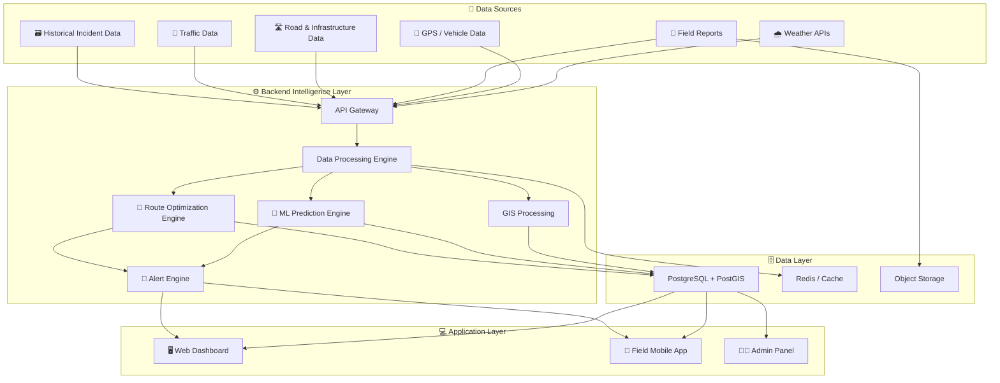

---

# 6. High-Level Data Flow

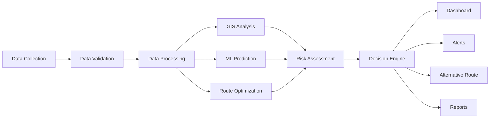

---

# 7. User Roles

## 👨‍💼 Administrator

Responsibilities:

* Manage users
* Manage districts
* Configure system
* View all data
* Monitor system health
* Manage access permissions

---

## 🏛️ Government / District Official

Responsibilities:

* Monitor transportation network
* View incidents
* Monitor supply vehicles
* Review route accessibility
* Receive alerts
* Generate reports

---

## 📱 Field Officer

Responsibilities:

* Report road damage
* Upload photographs
* Report landslides
* Report flooding
* Update accessibility status
* Submit geo-tagged incidents

---

## 🚚 Logistics Operator

Responsibilities:

* Register vehicles
* Monitor vehicle movement
* Track deliveries
* View route recommendations
* Update delivery status

---

# 8. Application Modules

The platform consists of the following major modules:

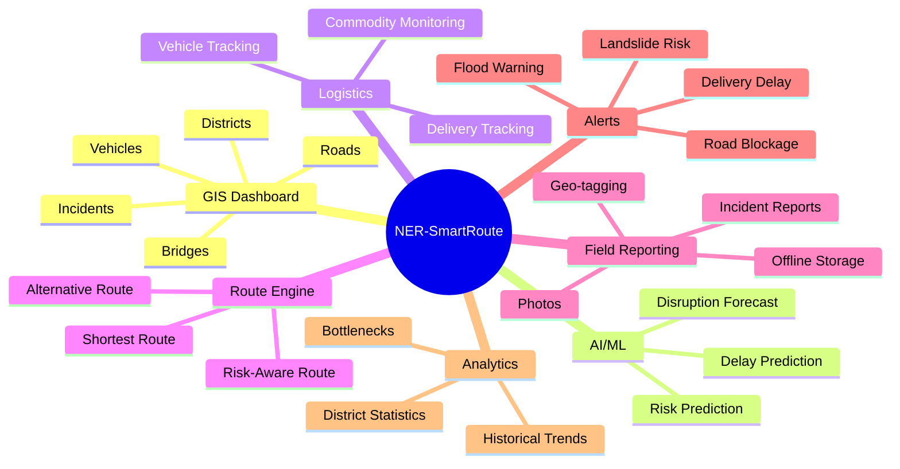

---

# 9. GIS & Accessibility Intelligence

The GIS module is the central visual component of the platform.

## Map Layers

The map can contain:

* District boundaries
* Roads
* Bridges
* High-risk corridors
* Blocked roads
* Flood-prone areas
* Landslide-prone areas
* Active vehicles
* Delivery destinations
* Field incidents
* Emergency routes

## Road Status

Each road can have one of four states:

```text
🟢 OPEN
🟡 PARTIALLY ACCESSIBLE
🟠 HIGH RISK
🔴 BLOCKED
```

### Example

```text
Road A
Status: HIGH RISK

Reasons:
- Heavy rainfall
- Previous landslide
- Poor road condition

Risk Score: 78/100
```

---

# 10. AI/ML Pipeline

The ML system processes multiple inputs before generating a risk prediction.

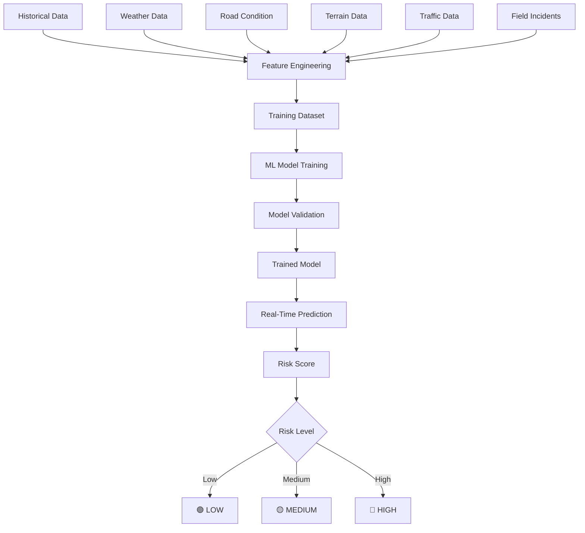

---

# 11. Route Optimization

The route engine should not consider distance alone.

A route may be geographically shorter but operationally unsafe.

Therefore, the system can calculate a composite route cost.

## Example Formula

```text
Route Cost =
Distance Cost
+ Travel Time Cost
+ Risk Cost
+ Weather Cost
+ Road Condition Cost
+ Traffic Cost
```

Conceptually:

```text
Total Cost =
w1 × Distance
+ w2 × Time
+ w3 × Risk
+ w4 × Weather
+ w5 × Road Condition
```

where:

```text
w1, w2, w3, w4, w5
```

are configurable weights.

---

## Route Optimization Flow

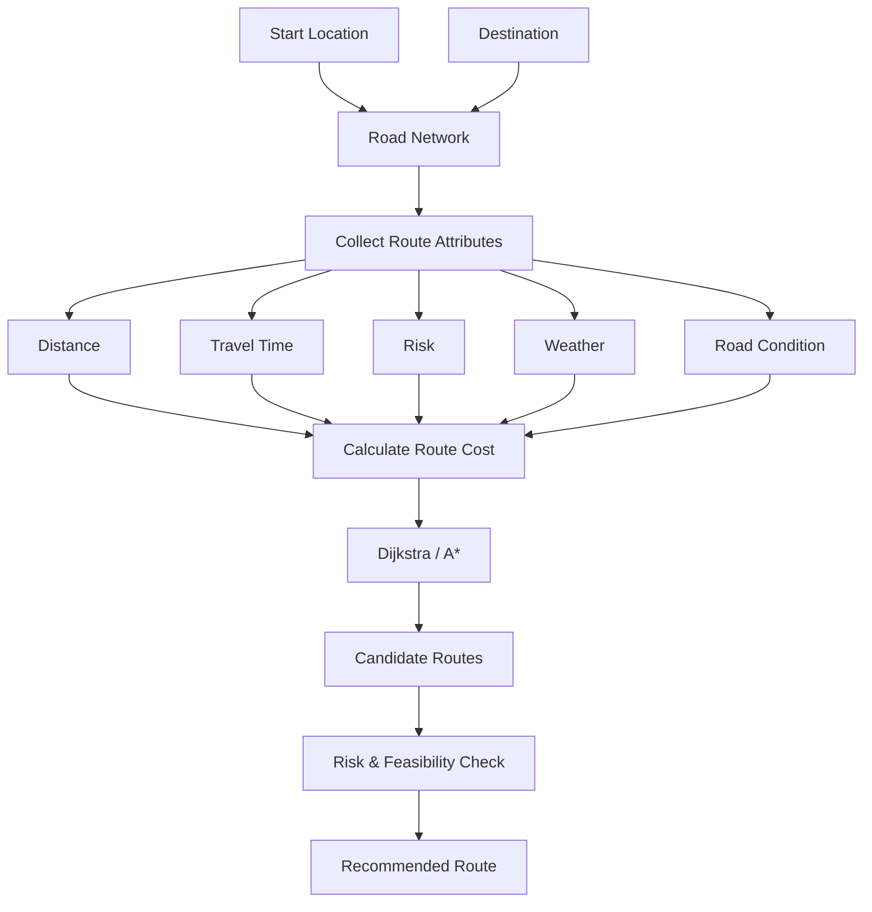

---

# 12. Disruption Prediction

The system can predict whether a route is likely to become disrupted.

## Example Inputs

| Feature            |  Example |
| ------------------ | -------: |
| Rainfall           |    85 mm |
| Road Condition     |     Poor |
| Previous Incidents |        4 |
| Terrain Risk       |     High |
| Traffic            |   Medium |
| River Level        | Elevated |

### Example Output

```text
Route Risk Prediction

Risk Score: 82%

Classification:
HIGH RISK

Possible Cause:
Heavy rainfall + vulnerable terrain

Recommended Action:
Monitor route and prepare alternate route.
```

> The prototype should present this as a **prediction/decision-support output**, not as a guaranteed forecast.

---

# 13. Vehicle Tracking

Vehicles transporting essential goods can be monitored using GPS.

## Vehicle Information

```text
Vehicle ID
Driver/Operator ID
Current Latitude
Current Longitude
Destination
Commodity
Delivery Status
Speed
Estimated Arrival
Route Risk
```

### Vehicle Tracking Flow

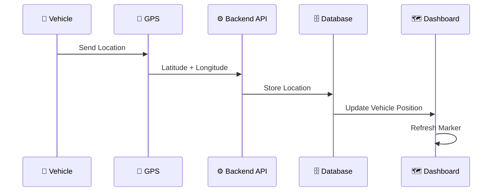

---

# 14. Field Reporting

Field officers can report incidents from remote locations.

## Report Fields

```text
Incident Type
Latitude
Longitude
Description
Photograph
Timestamp
Reporter ID
Severity
Road Status
```

### Incident Types

* Landslide
* Flood
* Road Damage
* Bridge Damage
* Traffic Blockage
* Fallen Tree
* Construction
* Other

### Field Reporting Flow

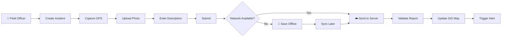

---

# 15. Alert & Notification System

The alert engine automatically monitors important conditions.

## Alert Examples

### 🚧 Road Blockage

```text
ROAD BLOCKED

Location:
[Latitude, Longitude]

Cause:
Landslide

Impact:
Vehicles cannot pass.

Action:
Alternative route available.
```

### 🌧️ Weather Alert

```text
HIGH RAINFALL ALERT

Corridor:
[Route Name]

Risk:
High

Action:
Monitor route accessibility.
```

### 🚚 Delivery Delay

```text
DELIVERY DELAY

Vehicle:
NER-TRUCK-024

Delay:
+2h 15m

Cause:
Road disruption
```

---

## Alert Architecture

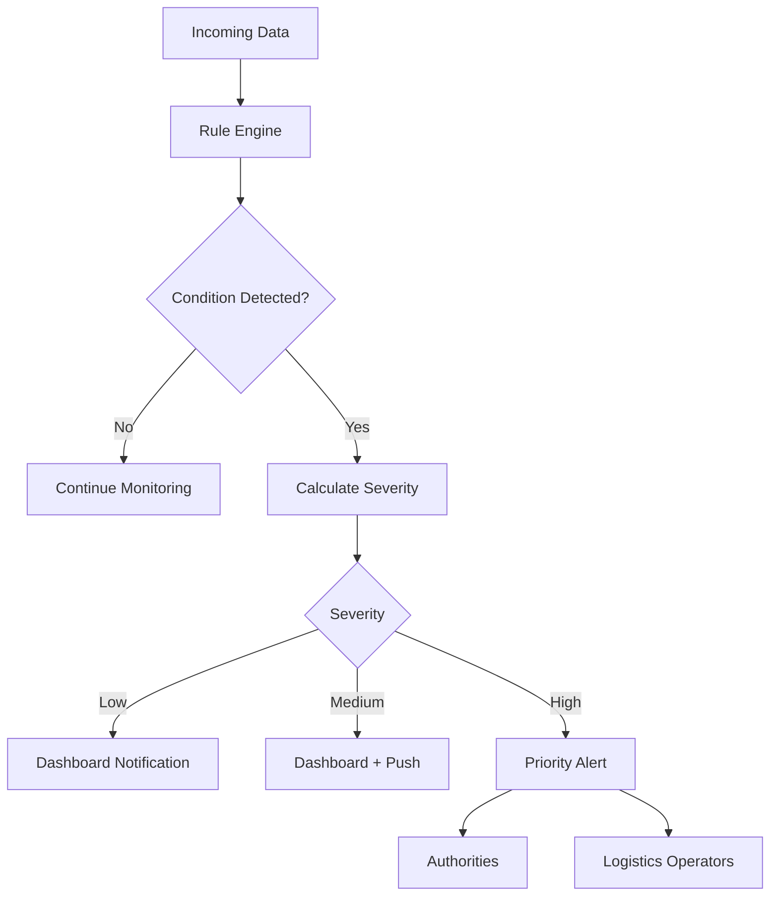

---

# 16. Offline Synchronization

Remote areas may have weak or intermittent connectivity.

The field application therefore follows an **offline-first approach**.

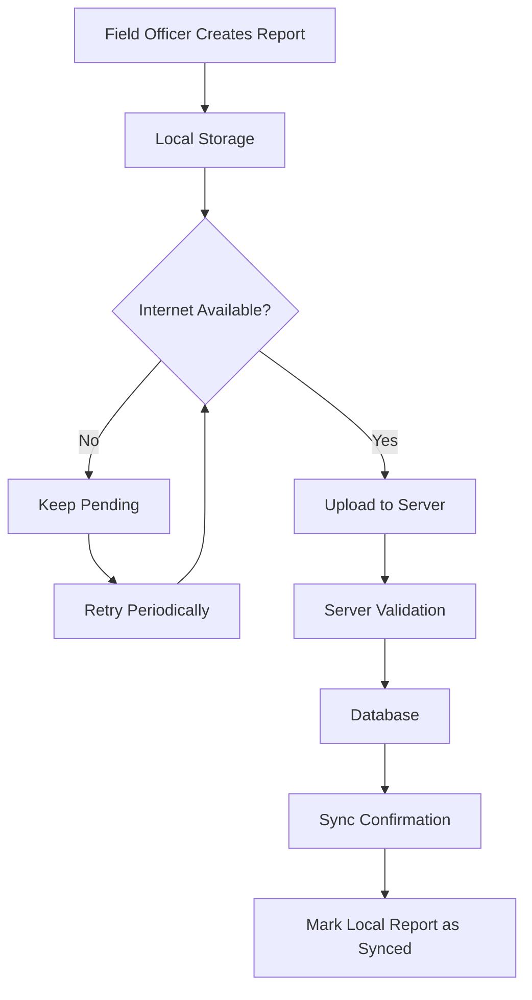

### Offline Data

The device can temporarily store:

* Incident reports
* Coordinates
* Photographs
* Timestamps
* Road status updates

When connectivity becomes available, pending records are synchronized.

---

# 17. Database Design

The prototype can use:

**PostgreSQL + PostGIS**

## Main Entities

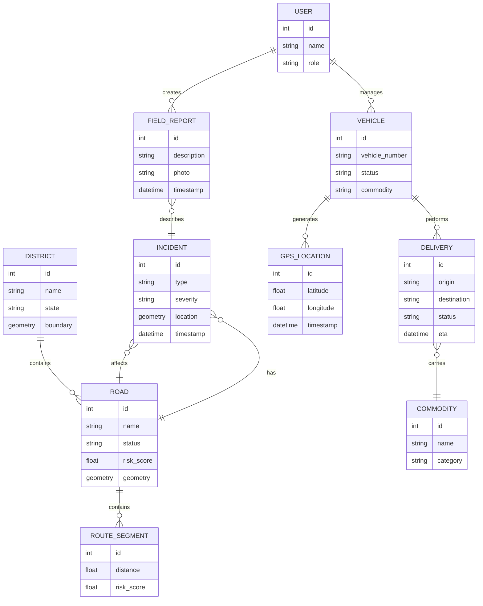

---

# 18. API Architecture

The backend exposes REST APIs to the web and mobile applications.

## Example Endpoints

### Authentication

```text
POST /api/auth/login/
POST /api/auth/logout/
```

### Roads

```text
GET  /api/roads/
GET  /api/roads/{id}/
PATCH /api/roads/{id}/status/
```

### Incidents

```text
GET  /api/incidents/
POST /api/incidents/
GET  /api/incidents/{id}/
```

### Vehicles

```text
GET  /api/vehicles/
GET  /api/vehicles/{id}/
POST /api/vehicles/location/
```

### Routes

```text
POST /api/routes/optimize/
POST /api/routes/alternative/
```

### Predictions

```text
POST /api/predictions/risk/
GET  /api/predictions/roads/
```

### Alerts

```text
GET  /api/alerts/
POST /api/alerts/{id}/acknowledge/
```

---

# 19. Technology Stack

## Frontend

* HTML5
* CSS3
* JavaScript
* Leaflet.js
* Bootstrap or Tailwind CSS

## Backend

* Python
* Django
* Django REST Framework

## Database

* PostgreSQL
* PostGIS

## AI/ML

* Python
* NumPy
* Pandas
* Scikit-learn

## GIS

* OpenStreetMap data
* Leaflet.js
* PostGIS

## APIs

* Weather API
* GPS/vehicle data API
* REST APIs

## Infrastructure

* Docker
* Cloud deployment
* HTTPS
* PostgreSQL

---

# 20. Project Structure

```text
NER-SmartRoute/
│
├── backend/
│   ├── manage.py
│   │
│   ├── config/
│   │   ├── settings.py
│   │   ├── urls.py
│   │   ├── asgi.py
│   │   └── wsgi.py
│   │
│   ├── users/
│   ├── roads/
│   ├── incidents/
│   ├── vehicles/
│   ├── deliveries/
│   ├── routes/
│   ├── alerts/
│   ├── weather/
│   └── analytics/
│
├── ml/
│   ├── datasets/
│   ├── notebooks/
│   ├── preprocessing/
│   ├── models/
│   ├── training/
│   └── inference/
│
├── frontend/
│   ├── templates/
│   ├── static/
│   │   ├── css/
│   │   ├── js/
│   │   └── images/
│   └── maps/
│
├── data/
│   ├── roads/
│   ├── districts/
│   ├── weather/
│   ├── incidents/
│   └── vehicles/
│
├── docs/
│   ├── architecture/
│   ├── api/
│   └── screenshots/
│
├── tests/
│
├── .env.example
├── .gitignore
├── requirements.txt
├── Dockerfile
├── docker-compose.yml
└── README.md
```

---

# 21. Installation

## Prerequisites

Install:

* Python 3.11+
* Git
* PostgreSQL
* Node.js (optional for advanced frontend development)

---

## Clone Repository

```bash
git clone <repository-url>
cd NER-SmartRoute
```

---

## Create Virtual Environment

### Windows

```bash
python -m venv venv
venv\Scripts\activate
```

### Linux/macOS

```bash
python3 -m venv venv
source venv/bin/activate
```

---

## Install Dependencies

```bash
pip install -r requirements.txt
```

---

# 22. Environment Variables

Create a `.env` file:

```env
DEBUG=True

SECRET_KEY=your-secret-key

DATABASE_NAME=ner_smartroute
DATABASE_USER=postgres
DATABASE_PASSWORD=your-password
DATABASE_HOST=localhost
DATABASE_PORT=5432

WEATHER_API_KEY=your-weather-api-key

ALLOWED_HOSTS=localhost,127.0.0.1
```

> Never commit `.env` files or API keys to GitHub.

---

# 23. Running the Project

Navigate to the backend:

```bash
cd backend
```

Run database migrations:

```bash
python manage.py makemigrations
python manage.py migrate
```

Create an admin user:

```bash
python manage.py createsuperuser
```

Start the development server:

```bash
python manage.py runserver
```

Open:

```text
http://127.0.0.1:8000/
```

---

# 24. Sample Workflow

Consider a medicine delivery from:

```text
Origin → Remote District
```

The system follows:

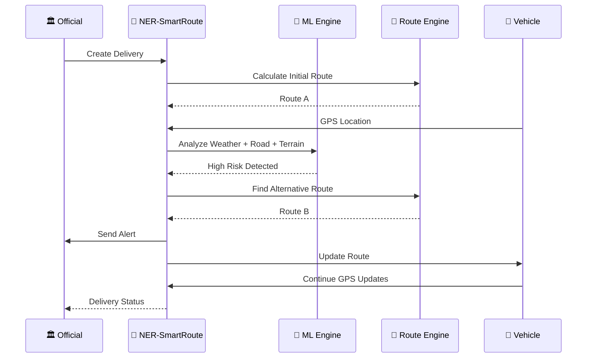

---

# 25. Example Use Case

## Scenario

A truck carrying medicines is travelling toward a remote district.

The system receives:

```text
Rainfall:
High

Road Condition:
Poor

Historical Risk:
High

Field Report:
Road partially blocked
```

The ML model generates:

```text
Risk Score: 82/100
Risk Level: HIGH
```

The route engine checks available roads.

### Current Route

```text
Distance: 180 km
ETA: 6h 20m
Risk: HIGH
```

### Alternative Route

```text
Distance: 205 km
ETA: 5h 30m
Risk: MEDIUM
```

The dashboard displays the information and alerts the responsible authority.

---

# 26. Security

The system should implement:

### Authentication

* Secure login
* Password hashing
* Session/token authentication

### Authorization

Role-based permissions:

```text
ADMIN
  ↓
OFFICIAL
  ↓
FIELD OFFICER
  ↓
LOGISTICS OPERATOR
```

### Data Security

* HTTPS
* Secure API authentication
* Encrypted sensitive data
* Input validation
* Secure file uploads
* Database access controls

### Privacy

Vehicle and personnel data should only be accessible to authorized users.

---

# 27. Scalability

The initial prototype may cover a limited geographical area.

The architecture should support expansion to:

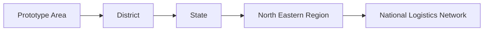

The system can eventually support:

* Multiple states
* Multiple departments
* Thousands of vehicles
* Large road networks
* Multiple weather sources
* Real-time streaming data

---

# 28. Future Enhancements

## 🤖 Advanced AI

Future versions could incorporate:

* Deep learning
* Time-series forecasting
* Computer vision
* Satellite imagery analysis
* Predictive maintenance

## 🛰️ Satellite Intelligence

Satellite imagery could help identify:

* Flooded roads
* Landslides
* Road damage
* Infrastructure changes

## 📷 Computer Vision

Images submitted by field officers could be analyzed automatically to classify:

```text
Road Damage
Flooding
Landslide
Debris
Bridge Damage
```

## 🧠 Advanced Prediction

The platform could eventually predict:

```text
Probability of disruption
Expected delay
Expected recovery time
Supply shortage risk
```

---

# 29. Expected Impact

NER-SmartRoute aims to support:

### 🚚 Logistics Efficiency

Better route planning and transportation visibility.

### 🚑 Emergency Response

Faster identification of accessible routes during disasters.

### 📦 Supply Chain Continuity

Reduced disruption to essential commodity movement.

### 🏗️ Infrastructure Planning

Historical data can highlight frequently disrupted corridors.

### 🌾 Agricultural Logistics

Improved transportation planning for agricultural produce.

### 🏛️ Government Monitoring

Centralized visibility of district-level accessibility.

---

# 30. Development Roadmap

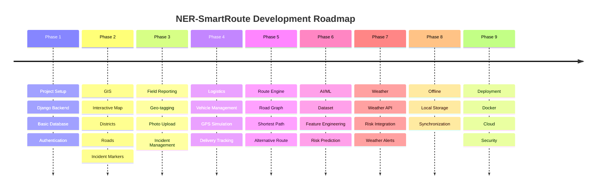

---

# 31. Team Roles

For a student/hackathon team, responsibilities can be divided as follows:

| Role                    | Responsibility                        |
| ----------------------- | ------------------------------------- |
| 👨‍💻 Backend Developer | Django, APIs, database                |
| 🎨 Frontend Developer   | Dashboard, UI, map                    |
| 🤖 ML Developer         | Prediction model                      |
| 🗺️ GIS Developer       | Maps, spatial data, routes            |
| 📱 App Developer        | Field reporting/offline functionality |
| 📊 Data Engineer        | Dataset preparation                   |
| ☁️ DevOps               | Deployment and infrastructure         |

For a smaller team, one person can handle multiple roles.

---

# 32. Conclusion

NER-SmartRoute proposes an integrated approach to logistics accessibility management in the North Eastern Region.

Instead of relying on isolated information sources, the platform brings together:

```text
Weather
   +
GPS
   +
Road Conditions
   +
Field Reports
   +
GIS
   +
Historical Data
   +
AI/ML
   ↓
Logistics Intelligence
   ↓
Risk Prediction
   +
Route Optimization
   +
Real-Time Monitoring
   +
Alerts
```

The ultimate goal is to provide authorities and logistics operators with **timely, location-aware and data-driven decision support** for transportation of essential goods and services.

---

# 🚀 MVP Definition

For the first working prototype, the following features are sufficient:

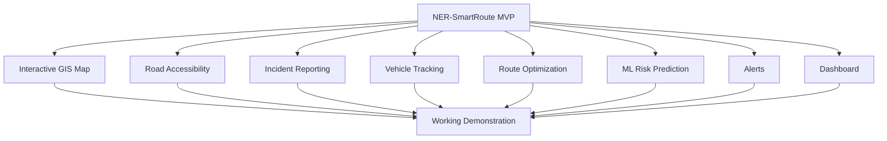

### MVP Success Criteria

The prototype should demonstrate one complete end-to-end scenario:

> **A road disruption is detected → the system updates the map → AI calculates risk → an alert is generated → an alternate route is calculated → a logistics vehicle is redirected → the dashboard shows the updated delivery status.**

That single workflow demonstrates the core intelligence of the proposed platform while keeping the first implementation realistic and achievable.

---

## 📄 License

This project is intended for educational, research, and prototype development purposes.

---

## 👥 Contributors

Add project contributors here:

```text
Name 1 — Backend / AI
Name 2 — Frontend / GIS
Name 3 — ML / Data
Name 4 — Mobile / Deployment
```

---

## ⭐ Project Vision

**"Making every route visible, every disruption predictable, and every essential delivery more resilient."**
